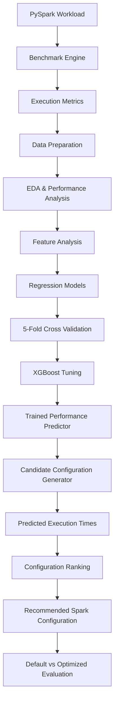

# ⚡ AI-Based Spark Job Performance Optimization


> **An ML-driven system for predicting Spark job execution time and recommending optimized Spark configurations.**

An end-to-end machine learning project that combines **PySpark benchmarking, performance analysis, regression modeling, and configuration optimization** to investigate how Spark execution parameters affect job performance.

The system learns from Spark execution data, predicts execution time for candidate configurations using a tuned **XGBoost regression model**, and recommends the configuration with the lowest predicted execution time.

---

# 📌 Project Overview

Apache Spark performance can vary significantly depending on workload characteristics and execution configuration.

Parameters such as:

- Number of partitions
- Executor memory
- Executor cores
- Caching
- Dataset size
- Data skew

can influence execution time.

Manually finding an efficient configuration can require repeated benchmark runs. This project explores an ML-based approach to reduce that experimentation by learning the relationship between workload characteristics, Spark configuration, and execution time.

```text
Spark Workload
      ↓
Benchmark Configurations
      ↓
Collect Execution Metrics
      ↓
EDA & Feature Analysis
      ↓
Train Regression Models
      ↓
Tune Best Model
      ↓
Predict Candidate Configurations
      ↓
Recommend Optimized Configuration
```

---

# 🎯 Problem Statement

Given a Spark workload profile and a set of candidate Spark configurations, predict the expected execution time and identify the configuration that minimizes it.

The current system considers workload and configuration characteristics such as:

- Number of records
- Number of partitions
- Executor memory
- Executor core count
- Data skew
- Caching configuration

Conceptually:

```text
Find configuration C
such that
Predicted Execution Time(C) → Minimum
```

---

# 🚀 Current Capabilities

The current implementation includes:

- Live PySpark micro-benchmarking
- Execution-time dataset preparation
- Exploratory Data Analysis
- Distribution and correlation analysis
- Data-skew analysis
- Regression model comparison
- 5-fold cross-validation
- XGBoost hyperparameter tuning
- Feature importance analysis
- Candidate configuration generation
- ML-based execution-time prediction
- Configuration recommendation
- Default vs optimized comparison

---

# 🔬 How It Works

## 1. Live Spark Benchmarking

A representative PySpark workload is executed across multiple configurations.

The current benchmark follows:

```text
Filter → GroupBy → Aggregate
```

For each configuration, the system records wall-clock execution time.

The benchmark varies parameters such as:

- Partition count
- Number of records
- Executor memory
- Executor cores
- Caching
- Data skew

The resulting measurements provide the execution dataset used for analysis and model development.

> Live benchmark timings depend on the local machine and Spark environment. They are primarily used for local sanity-checking.

---

## 2. Exploratory Data Analysis

The execution dataset is analyzed to understand the relationship between workload characteristics, Spark configuration, and execution time.

EDA includes:

- Execution-time distributions
- Feature distributions
- Correlation analysis
- Data-skew analysis
- Configuration-performance relationships

This helps identify which parameters have the strongest influence on execution time.

---

## 3. Model Comparison

Multiple regression algorithms are trained and evaluated using **5-fold cross-validation**.

| Model | Purpose |
|---|---|
| Linear Regression | Baseline regression model |
| ElasticNet | Regularized linear baseline |
| Random Forest | Non-linear ensemble model |
| Gradient Boosting | Boosted tree regression |
| XGBoost | High-performance gradient boosting |

Evaluation uses:

- R²
- MAE
- RMSE
- Cross-validation R²

---

## 4. XGBoost Hyperparameter Tuning

XGBoost is further optimized using `RandomizedSearchCV`.

The search explores parameters including:

- `n_estimators`
- `max_depth`
- `learning_rate`
- `subsample`
- Regularization parameters

The tuned XGBoost model is used as the primary execution-time predictor.

---

# 📊 Model Performance

The current tuned XGBoost model achieved:

| Metric | Value |
|---|---:|
| **Model** | **XGBoost (Tuned)** |
| **R²** | **0.9739** |
| **MAE** | **0.96 s** |
| **RMSE** | **1.54 s** |
| **CV R² (5-fold)** | **0.9551 ± 0.0000** |

> These results are specific to the current benchmark dataset and workload distribution and should not be interpreted as a universal Spark performance guarantee.

---

# 🔍 Feature Importance

The current model identifies the following features as the strongest drivers of execution-time prediction:

| Rank | Feature | Importance |
|---:|---|---:|
| 1 | `partitions` | **0.9507** |
| 2 | `data_skew` | **0.0247** |
| 3 | `num_records` | **0.0144** |

### Key Observation

`partitions` is currently the dominant feature in the trained model, making partition selection an important area for further experimentation.

---

# ⚙️ Configuration Recommendation Engine

The trained XGBoost model is used to evaluate candidate Spark configurations.

```text
Workload Profile
       ↓
Generate Candidate Configurations
       ↓
Predict Execution Time
       ↓
Rank Configurations
       ↓
Select Minimum Predicted Time
       ↓
Recommended Configuration
```

For example:

```text
Input:
    Records: 5M
    Data Skew: Moderate

Candidate Configurations:
    Config A → predicted 7.2s
    Config B → predicted 5.1s
    Config C → predicted 4.3s
    Config D → predicted 6.0s

Recommendation:
    Config C
```

This turns the trained regression model into a practical configuration recommendation component.

---

# ⚡ Default vs Optimized Performance

The recommendation engine is evaluated against Spark's default configuration for representative workload profiles.

| Job Profile | Default | Optimized | Improvement |
|---|---:|---:|---:|
| 1M records, low skew | 17s | 5s | **↓ 71.9%** |
| 5M records, moderate skew | 16s | 4s | **↓ 75.1%** |
| 10M records, high skew | 17s | 4s | **↓ 74.5%** |

These values represent the current benchmark and recommendation experiments and depend on the execution environment.

---

# 🧠 System Architecture




---

# 📁 Repository Structure

```text
spark-job-Optimization/
│
├── notebooks/
│   └── spark_ai_optimizer.ipynb
│
├── data/
│   └── README.md
│
├── outputs/
│   ├── eda_plots.png
│   ├── dashboard.png
│   └── feature_importance.png
│
├── requirements.txt
├── .gitignore
└── README.md
```

---

# ⚙️ Installation

## Clone the Repository

```bash
git clone https://github.com/saklaniabhimanyu/spark-job-Optimization.git
cd spark-job-Optimization
```

## Create a Virtual Environment

### Linux / macOS

```bash
python -m venv venv
source venv/bin/activate
```

### Windows

```bash
python -m venv venv
venv\Scripts\activate
```

## Install Dependencies

```bash
pip install -r requirements.txt
```

---

# ▶️ Running the Project

Place the required dataset inside:

```text
data/
```

Expected dataset:

```text
Spark_realtime_metrices.csv
```

Then launch Jupyter:

```bash
jupyter notebook
```

Open:

```text
notebooks/spark_ai_optimizer.ipynb
```

Run the notebook sequentially to reproduce the analysis and optimization workflow.

---

# 📦 Dataset

The project expects Spark execution metrics containing workload characteristics, configuration parameters, and observed execution times.

The dataset is used for:

- Exploratory Data Analysis
- Model training
- Cross-validation
- Hyperparameter tuning
- Feature importance analysis
- Configuration recommendation

Dataset placement instructions are provided in:

```text
data/spark_execution_logs.csv
```

---

# 🛠️ Technology Stack

### Big Data

- Apache Spark
- PySpark

### Machine Learning

- Scikit-learn
- XGBoost

### Data Processing

- Pandas
- NumPy

### Visualization

- Matplotlib
- Seaborn

### Development

- Python
- Jupyter Notebook
- Git
- GitHub

---

# 🚀 Future Direction

The long-term goal is to evolve the project from:

```text
ML Model
   ↓
Predict Execution Time
   ↓
Recommend Configuration
```

into a closed-loop optimization system:

```text
Spark Job
    ↓
Collect Runtime Metrics
    ↓
Analyze Workload
    ↓
Predict Performance
    ↓
Search Configuration Space
    ↓
Recommend Configuration
    ↓
Execute Job
    ↓
Measure Actual Performance
    ↓
Learn From Result
    ↓
Improve Future Recommendations
```

This would allow the system to continuously learn from real Spark executions and improve future configuration recommendations.


---

# ⚠️ Limitations

The current implementation has several limitations:

- The benchmark represents a controlled micro-workload rather than a complete production Spark workload.
- Live execution timings are environment-dependent.
- The current dataset does not cover every possible Spark configuration.
- Model performance depends on the training-data distribution.
- The recommendation engine currently uses candidate-grid search rather than continuous optimization.
- Full Spark event-log and executor-level telemetry are not yet incorporated.
- Reported improvements are specific to the evaluated benchmark scenarios.

These limitations also define several of the project's planned development directions.

---

# 🎯 Key Results

| Component | Result |
|---|---|
| Best Model | **Tuned XGBoost** |
| R² | **0.9739** |
| MAE | **0.96 s** |
| RMSE | **1.54 s** |
| 5-Fold CV R² | **0.9551 ± 0.0000** |
| Strongest Feature | **partitions** |
| Top Feature Importance | **0.9507** |
| Maximum Reported Improvement | **75.1%** |

---

# 💡 Key Takeaways

- Spark configuration has a measurable impact on execution time.
- Machine learning can model the relationship between workload characteristics and Spark performance.
- XGBoost currently provides the strongest prediction performance among the evaluated models.
- Partition count is currently the dominant feature in the benchmarked dataset.
- The recommendation engine demonstrates how an ML model can be used to search for potentially better Spark configurations.
- The project provides a foundation for developing a workload-aware and adaptive Spark optimization system.

---

# 📚 References

- [Apache Spark](https://spark.apache.org/)
- [Scikit-learn](https://scikit-learn.org/)
- [XGBoost](https://xgboost.readthedocs.io/)

---

# 👤 Author

**Abhimanyu Saklani**

- GitHub: https://github.com/saklaniabhimanyu
- Project: https://github.com/saklaniabhimanyu/spark-job-Optimization

⭐ If you find this project useful, consider giving the repository a star.