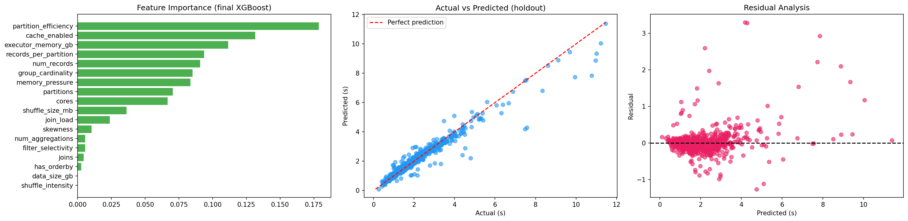
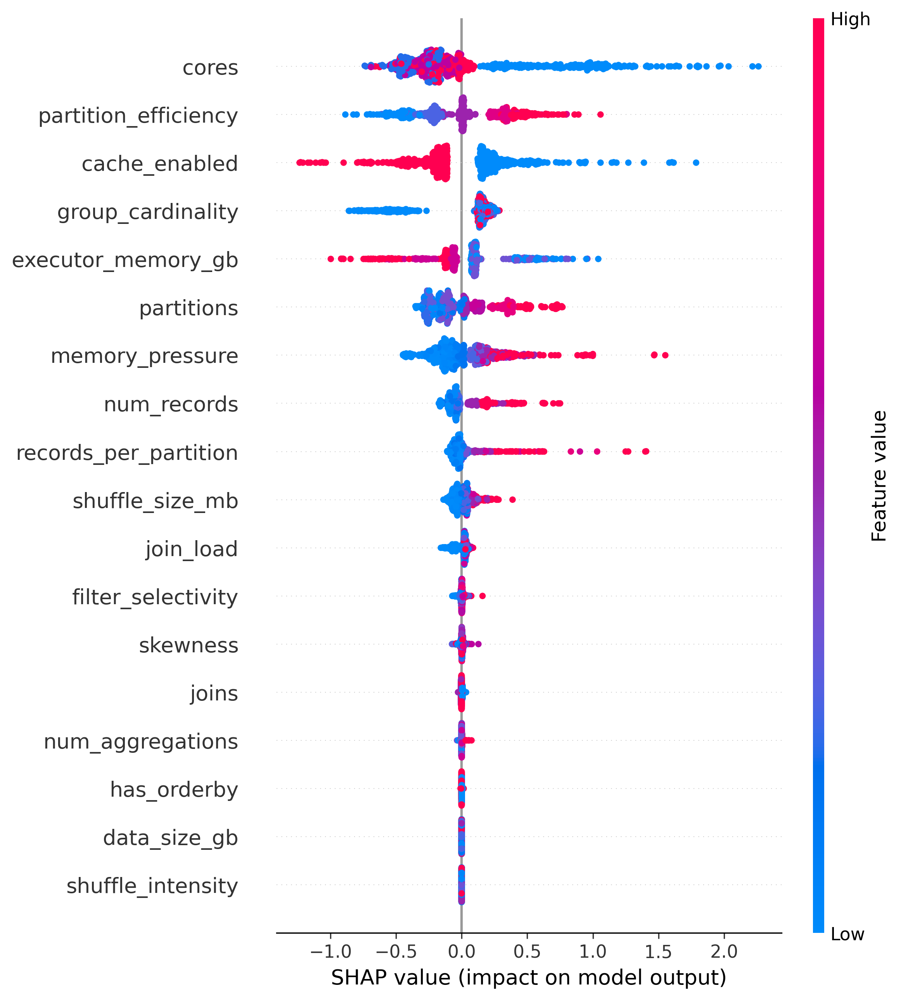
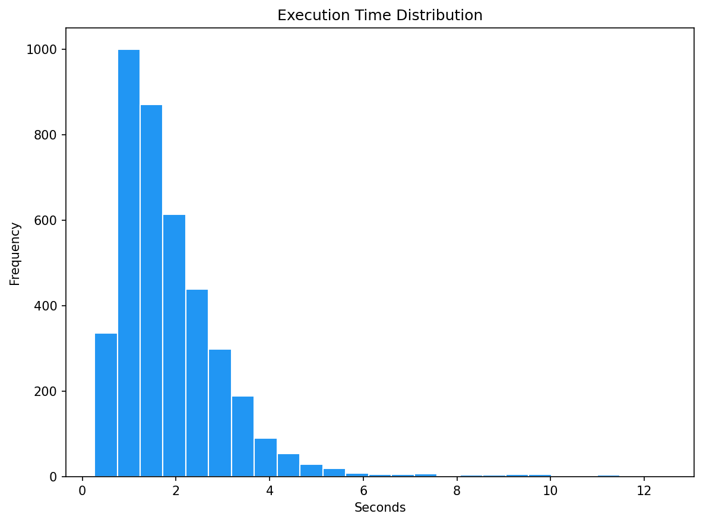
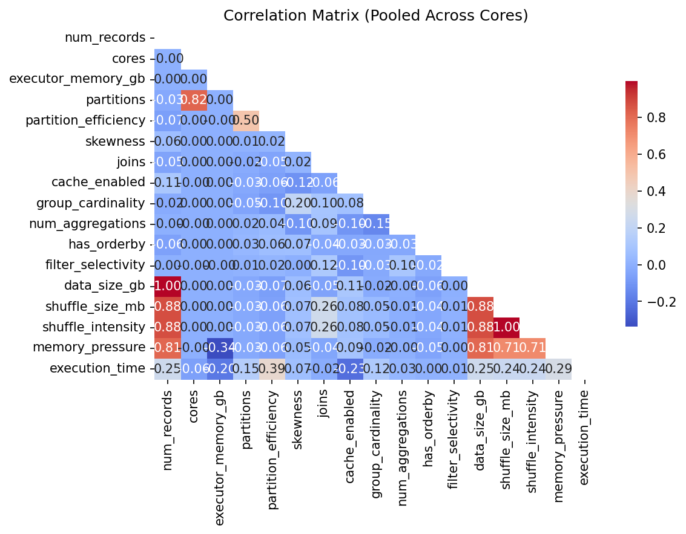
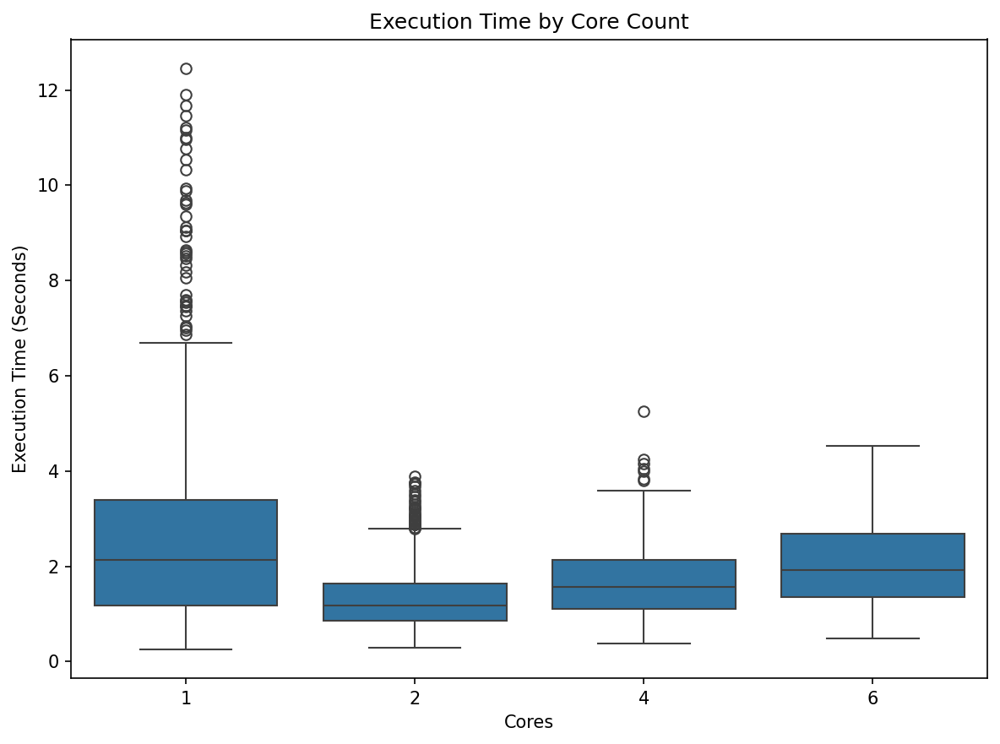
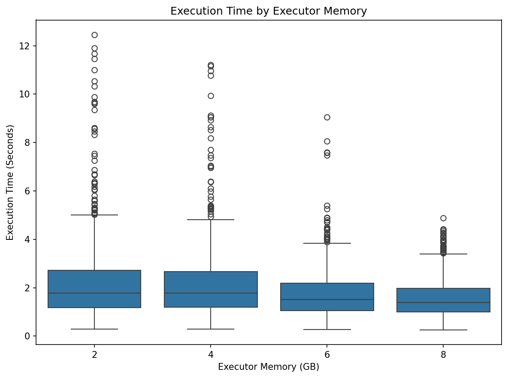
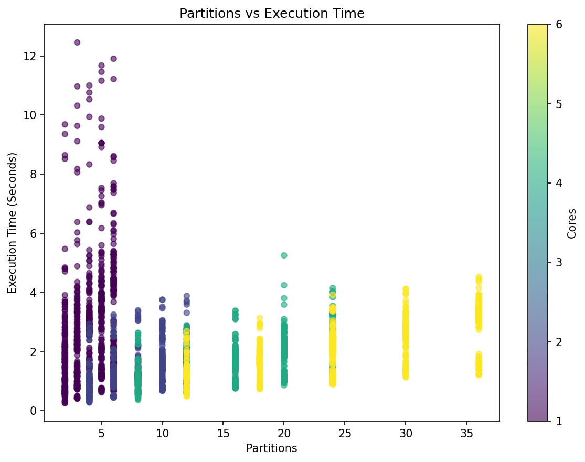
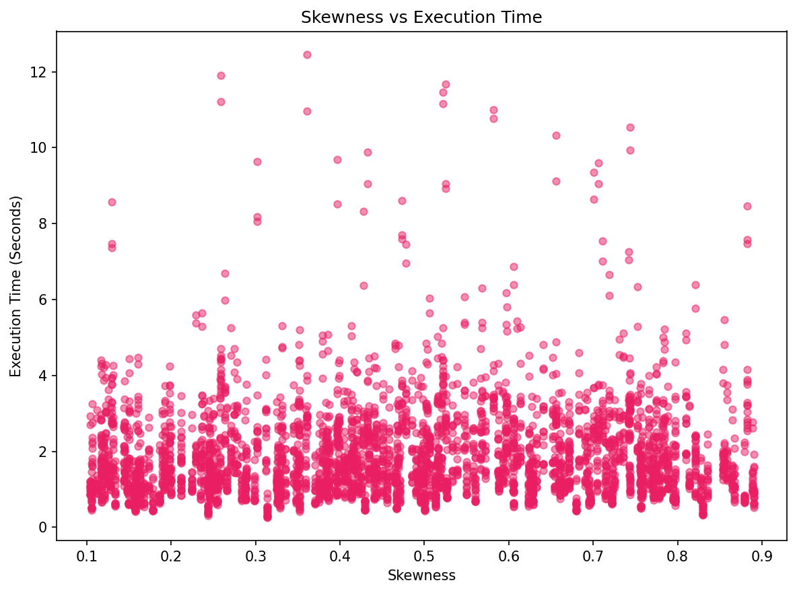

# Spark Job Performance Optimization System

An ML-based system that predicts Apache Spark job execution time and recommends better Spark configurations for different workload profiles.

The system uses **XGBoost** to learn the relationship between workload characteristics, Spark resources, and execution time. It then evaluates candidate configurations and ranks them by predicted runtime.

---

## Overview

Spark performance depends heavily on configuration choices such as:

- Executor cores
- Executor memory
- Number of partitions
- Cache usage
- Workload size
- Data skew
- Number of joins and aggregations

Finding a good configuration manually can require repeated experimentation.

This project uses machine learning to reduce that trial-and-error process:

```text
Workload Profile
       │
       ▼
Feature Construction
       │
       ▼
Trained XGBoost Model
       │
       ▼
Evaluate Candidate Configurations
       │
       ▼
Rank by Predicted Execution Time
       │
       ▼
Recommended Spark Configuration
```

---

## Key Features

* **Execution-time prediction** using XGBoost regression
* **Spark-specific feature construction** for workload and resource characteristics, including 5 candidate engineered features screened by ablation
* **Data-driven feature selection** — candidate engineered features are kept or dropped based on measured cross-validated impact, not intuition
* **Multi-model comparison** (Linear Regression, Elastic Net, Random Forest, Gradient Boosting, XGBoost) with 5-fold cross-validation
* **Hyperparameter optimization** via `RandomizedSearchCV`
* **Held-out test evaluation**, touched exactly once
* **SHAP-based explainability** for understanding model predictions
* **Configuration recommendation engine** for ranking candidate Spark configurations
* **Baseline comparison** between default and recommended configurations, backed by real re-run Spark jobs
* **Two generalization experiments** — leave-one-hardware-config-out and leave-one-workload-type-out — to check how much the model relies on interpolation
* **FastAPI REST API** for serving recommendations
* **Automated unit tests** for core recommendation and utility logic, including a regression test against the real trained model

---

## Model Performance

The tuned XGBoost model, evaluated on a held-out test set touched exactly once:

| Metric   |    Result |
| -------- | --------: |
| R²       | **0.9414** |
| MAE      | **0.17 s** |
| RMSE     | **0.35 s** |

### Model comparison (5-fold CV, development set)

| Model               |            R² |        MAE |       RMSE |
| ------------------- | ------------: | ----------: | ----------: |
| Linear Regression    | 0.4045 ± 0.0251 | 0.63 ± 0.01 | 0.92 ± 0.02 |
| Elastic Net          | 0.4018 ± 0.0202 | 0.63 ± 0.01 | 0.92 ± 0.03 |
| Random Forest        | 0.8947 ± 0.0130 | 0.18 ± 0.01 | 0.38 ± 0.02 |
| Gradient Boosting    | 0.9080 ± 0.0110 | 0.18 ± 0.01 | 0.36 ± 0.02 |
| XGBoost (untuned)    | 0.8977 ± 0.0090 | 0.18 ± 0.01 | 0.38 ± 0.02 |

Gradient Boosting narrowly leads on raw CV R², but XGBoost was carried forward and tuned — `RandomizedSearchCV` (40 candidates, 5-fold) raised it to **CV R² = 0.9154**, ahead of every untuned candidate above, before final evaluation on the untouched holdout set.

The recommendation engine was evaluated across **10 simulated workload profiles**, where the recommended configurations produced an average **50.5% observed runtime reduction** compared with the selected default configurations.

Because the workloads are simulated, these results should be interpreted as experimental validation of the optimization approach rather than production performance guarantees.

---

## Machine Learning Pipeline

### 1. Workload Generation

The project uses reproducible simulated Spark workloads with different combinations of:

* Number of records
* Data skew
* Joins
* Group cardinality
* Number of aggregations
* `ORDER BY`
* Filter selectivity
* Spark resource configurations

Execution time is used as the prediction target.

The simulation-based approach makes experiments reproducible without requiring a continuously running Spark cluster.

---

### 2. Feature Construction & Selection

16 raw features plus 5 candidate engineered features (21 total) go through a collinearity check (variance inflation factor) and a leave-one-feature-out **ablation study**:

```text
num_records            cores                   executor_memory_gb
partitions              partition_efficiency    skewness
joins                   cache_enabled           group_cardinality
num_aggregations        has_orderby             filter_selectivity
data_size_gb            shuffle_size_mb         shuffle_intensity
memory_pressure          records_per_partition ← engineered, kept
join_load                                      ← engineered, kept
```

Two engineered features — `records_per_partition` and `join_load` — improved CV R² when included and were kept. Three others (`agg_complexity`, `skew_joins_interaction`, `log_num_records`) didn't earn their place and were dropped, keeping the final model at **18 features** instead of 21.

| Removed feature | CV R² | Δ vs full model |
|---|---:|---:|
| cache_enabled | 0.8845 | −0.0320 |
| executor_memory_gb | 0.8979 | −0.0187 |
| cores | 0.9098 | −0.0067 |
| records_per_partition | 0.9150 | −0.0016 |
| group_cardinality | 0.9150 | −0.0016 |
| has_orderby | 0.9155 | −0.0010 |
| num_aggregations | 0.9155 | −0.0010 |
| num_records | 0.9156 | −0.0009 |
| partitions | 0.9156 | −0.0009 |
| join_load | 0.9163 | −0.0002 |
| data_size_gb | 0.9164 | −0.0001 |
| *(none — full model)* | 0.9165 | 0.0000 |
| memory_pressure | 0.9166 | +0.0001 |
| skew_joins_interaction | 0.9169 | +0.0004 |
| shuffle_size_mb | 0.9170 | +0.0005 |
| shuffle_intensity | 0.9170 | +0.0005 |
| log_num_records | 0.9174 | +0.0009 |
| partition_efficiency | 0.9175 | +0.0009 |
| joins | 0.9177 | +0.0012 |
| filter_selectivity | 0.9180 | +0.0014 |
| agg_complexity | 0.9180 | +0.0015 |
| skewness | 0.9184 | +0.0019 |

A negative Δ means removing that feature *hurt* CV performance ; a positive Δ means the model performed just as well or better without it.


---

### 3. Model Comparison

Multiple regression models are evaluated before selecting the final model:

* Linear Regression
* Elastic Net
* Random Forest
* Gradient Boosting
* XGBoost

Models are evaluated using MAE, RMSE, R², and 5-fold cross-validation. See [Model Performance](#model-performance) above for exact numbers.

---

### 4. Hyperparameter Optimization

XGBoost hyperparameters are optimized using `RandomizedSearchCV` (40 candidates × 5-fold CV = 200 fits). Best configuration found:

```text
subsample: 0.7        reg_lambda: 1          reg_alpha: 0
n_estimators: 300      min_child_weight: 3    max_depth: 4
learning_rate: 0.03    gamma: 0.2             colsample_bytree: 1.0
```

The final model is selected based on validation performance and evaluated once on a held-out test set.

---

## Explainability



**Top drivers of predicted execution time** (split-based importance):

| Feature | Importance |
|---|---:|
| partition_efficiency | 0.1787 |
| cache_enabled | 0.1315 |
| executor_memory_gb | 0.1114 |
| records_per_partition | 0.0938 |
| num_records | 0.0908 |
| group_cardinality | 0.0850 |
| memory_pressure | 0.0834 |
| partitions | 0.0704 |
| cores | 0.0666 |

`partition_efficiency` (partitions/cores) and `cache_enabled` dominate — resource layout matters more to this model than raw workload size.

SHAP confirms the direction and magnitude of these effects per prediction:



---

## Configuration Recommendation

For a given workload, the recommendation engine evaluates a predefined grid of Spark configurations.

Example — 1M records, skew 0.30, 1 join, 2 aggregations:

```text
Workload
   │
   ├── 1M records
   ├── skew = 0.30
   ├── joins = 1
   └── aggregations = 2
          │
          ▼
   Candidate Configurations
          │
          ▼
   XGBoost Predictions
          │
          ▼
   Sort by predicted runtime
          │
          ▼
   Top-N configurations
```

| Rank | Cores | Memory | Partitions | Cache | Predicted time |
|---|---:|---:|---:|---:|---:|
| 1 | 1 | 8g | 2 | on | 0.50s |
| 2 | 2 | 8g | 4 | on | 0.65s |
| 3 | 2 | 6g | 4 | on | 0.66s |
| 4 | 2 | 2g | 4 | on | 0.66s |
| 5 | 2 | 1g | 4 | on | 0.67s |

The output includes recommended executor cores, executor memory, partition count, cache setting, predicted execution time, and derived resource/workload features.

---

## Evaluation Experiments

### EDA








### Recommendation Validation

The model's #1 recommendation for 5 held-out workloads, compared against a real re-run Spark job:

| Records | Skew | Predicted | Actual | Error |
|---:|---:|---:|---:|---:|
| 100,000 | 0.82 | 0.55s | 0.75s | 26.6% |
| 1,000,000 | 0.61 | 0.20s | 0.72s | 72.7% |
| 100,000 | 0.66 | 0.39s | 0.70s | 44.5% |
| 100,000 | 0.87 | 0.48s | 0.83s | 42.8% |
| 100,000 | 0.54 | 0.51s | 0.70s | 26.6% |

Full data: [`outputs/09_recommendation_validation.csv`](outputs/09_recommendation_validation.csv)

Predicted-vs-actual error is meaningfully higher here than the holdout MAE (0.17s) would suggest — these are small-magnitude execution times (sub-second), where the same absolute error translates into a much larger percentage error. Worth narrowing before relying on the model for very short-running jobs.

### Ranking Evaluation

Across 3 workloads, checking whether the model's #1 pick was actually the best of its own top-5 candidates (re-run for real):

```text
Top-1: 0%   Top-3: 33%   Top-5: 100%   Mean regret: +0.228s
```

Full data: [`outputs/10_ranking_evaluation.csv`](outputs/10_ranking_evaluation.csv)

### Baseline Comparison

Default Spark configuration vs. the model's #1 recommendation, both re-run as real Spark jobs, across 10 workload profiles:

| Workload profile | Default | Optimized | Improvement |
|---|---:|---:|---:|
| 500K records, very low skew, minimal aggregation | 1.29s | 0.70s | +45.5% |
| 1M records, low skew, simple query | 1.22s | 0.85s | +30.2% |
| 2M records, moderate skew, single join | 1.32s | 0.85s | +35.5% |
| 3M records, low skew, aggregation-heavy query | 1.42s | 0.82s | +42.1% |
| 5M records, moderate skew, join + orderby | 1.97s | 0.91s | +53.6% |
| 7M records, low skew, multiple joins without orderby | 2.13s | 1.07s | +49.6% |
| 8M records, high aggregation, join + orderby | 2.02s | 0.98s | +51.6% |
| 10M records, high skew, heavy join workload | 2.45s | 1.02s | +58.2% |
| 15M records, extreme skew, complex join workload | 3.02s | 1.07s | +64.7% |
| 20M records, high skew, highly selective complex query | 4.70s | 1.20s | +74.4% |
| **Average** | | | **+50.5%** |

Improvement scales with workload size — larger, more complex jobs benefit more from ML-selected configurations than small ones do.

Full data: [`outputs/11_baseline_comparison.csv`](outputs/11_baseline_comparison.csv)

### Generalization — Leave-One-Hardware-Config-Out

Trains on 15 of 16 hardware configs, tests on the held-out one entirely — the honest out-of-distribution number, vs. the random-split holdout above.

```text
Mean out-of-hardware R²           : 0.7984
Random-split holdout R² (for ref) : 0.9414
Generalization gap                : +0.1430
```

A positive gap means the model partly relies on interpolation within hardware configs it has already seen. One config in particular — **1 core / 8GB memory** — generalized poorly (R² = **−0.28**, worse than predicting the mean), the weakest point in an otherwise strong table:

| Held-out config | R² | MAE |
|---|---:|---:|
| 1core_2g | 0.928 | 0.421 |
| 1core_4g | 0.372 | 1.290 |
| 1core_6g | 0.354 | 0.813 |
| **1core_8g** | **−0.281** | 0.634 |
| 2core_2g | 0.922 | 0.135 |
| 2core_4g | 0.937 | 0.102 |
| 2core_6g | 0.959 | 0.088 |
| 2core_8g | 0.953 | 0.102 |
| 4core_2g | 0.971 | 0.087 |
| 4core_4g | 0.966 | 0.075 |
| 4core_6g | 0.968 | 0.094 |
| 4core_8g | 0.912 | 0.153 |
| 6core_2g | 0.982 | 0.088 |
| 6core_4g | 0.977 | 0.093 |
| 6core_6g | 0.936 | 0.123 |
| 6core_8g | 0.916 | 0.159 |

Single-core configs generalize noticeably worse than multi-core ones — worth more benchmark data at `cores=1` before trusting recommendations there.

Full data: [`outputs/12_generalization_experiment.csv`](outputs/12_generalization_experiment.csv)

### Generalization — Leave-One-Workload-Type-Out

Same idea, grouped by workload shape instead of hardware:

| Workload type | Rows | R² | MAE |
|---|---:|---:|---:|
| aggregation_heavy | 640 | 0.888 | 0.215 |
| high_skew | 352 | 0.955 | 0.168 |
| join_heavy | 2,816 | 0.870 | 0.247 |
| simple_scan | 192 | 0.877 | 0.172 |

Mean R² = **0.898** — more consistent across workload types than across hardware configs, suggesting the model generalizes better along the workload-shape axis than the hardware axis.

Full data: [`outputs/13_workload_type_experiment.csv`](outputs/13_workload_type_experiment.csv)

---

## API

The trained model is exposed through a **FastAPI** service.

Start the API with:

```bash
uvicorn api.main:app --reload
```

The API will be available at:

```text
http://127.0.0.1:8000
```

### API Documentation

FastAPI automatically provides interactive API documentation at:

```text
http://127.0.0.1:8000/docs
```

### Available endpoints

```text
GET  /
GET  /model/info
POST /recommend
```

The `/recommend` endpoint accepts a workload profile and returns ranked Spark configuration recommendations.

---

## Running with Docker

```bash
docker build -t spark-job-optimizer .
docker run -p 8000:8000 spark-job-optimizer
```

Or with Docker Compose (mounts `models/` so a locally retrained model is picked up without a rebuild):

```bash
docker-compose up --build
```

Then open `http://localhost:8000` for the demo UI, or POST to `/recommend`.

---

## Running the Application

### 1. Clone the repository

```bash
git clone https://github.com/saklaniabhimanyu/spark-job-Optimization.git
cd spark-job-Optimization
```

### 2. Create a virtual environment

#### Windows

```powershell
python -m venv venv
.\venv\Scripts\activate
```

#### Linux / macOS

```bash
python3 -m venv venv
source venv/bin/activate
```

### 3. Install dependencies

```bash
pip install -r requirements.txt
```

### 4. Start the API

```bash
uvicorn api.main:app --reload
```

Then open:

```text
http://localhost:8000
```

---

## Running Tests

Run:

```bash
pytest tests/ -v
```

Current test suite:

```text
19 tests
19 passed
```

The test suite validates:

* Candidate configuration generation
* Feature ordering, including against the real saved model
* Recommendation ranking and `top_n` handling
* Derived feature calculations
* Evaluation utilities
* Experiment tracking

---

## Project Structure

```text
spark-job-Optimization/
│
├── api/
│   ├── main.py
│   └── static/
│       └── index.html
│
├── src/
│   ├── config.py
│   ├── spark_utils.py
│   ├── model_training.py
│   ├── bayesian_tuning.py
│   ├── evaluation.py
│   ├── explainability.py
│   ├── experiment_tracker.py
│   └── recommendation_engine.py
│
├── notebooks/
│   └── spark_ai_optimizer.ipynb
│
├── data/
│   └── Spark_realtime_metrices.csv
│
├── models/
│   ├── best_model.joblib
│   └── final_features.json
│
├── outputs/
│   ├── 01_execution_time_distribution.png
│   ├── 02_correlation_matrix.png
│   ├── 03_execution_time_by_cores.png
│   ├── 04_execution_time_by_memory.png
│   ├── 05_partitions_vs_execution_time.png
│   ├── 06_skewness_vs_execution_time.png
│   ├── 07_model_interpretation.png
│   ├── 08_shap_summary.png
│   ├── 09_recommendation_validation.csv
│   ├── 10_ranking_evaluation.csv
│   ├── 11_baseline_comparison.csv
│   ├── 12_generalization_experiment.csv
│   └── 13_workload_type_experiment.csv
│
├── tests/
│   ├── test_evaluation.py
│   ├── test_experiment_tracker.py
│   └── test_recommendation_engine.py
│
├── main.py
├── requirements.txt
├── Dockerfile
├── docker-compose.yml
├── .dockerignore
├── .gitignore
└── README.md
```

---

## Tech Stack

### Machine Learning

* Python
* Scikit-learn
* XGBoost
* SHAP

### Data & Big Data

* Apache Spark
* PySpark
* Pandas
* NumPy

### Experimentation

* Jupyter Notebook

### API & Deployment

* FastAPI
* Uvicorn
* Docker

### Testing & Development

* Pytest
* Git
* GitHub

---

## Results

The system demonstrates that a machine-learning model can learn relationships between Spark workload characteristics and execution performance and use those predictions to rank candidate configurations.

The tuned XGBoost model achieved:

**R² = 0.9414** · **MAE = 0.17s** · **RMSE = 0.35s** (random-split holdout)

Out-of-distribution checks are notably weaker than the headline number:

* **R² = 0.7984** leaving one hardware config out at a time (one config, `1core_8g`, generalized very poorly)
* **R² = 0.8977** leaving one workload type out at a time

Across the 10 evaluated simulated workloads, ML-based configuration recommendations produced an average **50.5% observed runtime reduction** compared with the selected default configurations. In a smaller 3-workload ranking check, the model's single top pick matched the true best configuration 0% of the time, though the true best was always within its top 5 — worth a larger ranking-evaluation sample before treating the #1 pick alone as reliable.

The project also uses SHAP analysis to provide insight into the factors influencing runtime predictions — `partition_efficiency` and `cache_enabled` dominate.

---

## Limitations

The current implementation has several limitations:

* Training data is primarily simulation-based; simulated execution times may not capture all real Spark cluster behaviour (network latency, JVM overhead, storage systems, cluster contention).
* The random-split holdout R² (0.9414) is optimistic relative to genuine out-of-distribution performance — leave-one-hardware-out R² drops to 0.7984, and one specific configuration (1 core / 8GB) generalizes especially poorly (R² = −0.28).
* Recommendation ranking accuracy was evaluated on a small sample (3 workloads for ranking, 5 for validation) — Top-1 accuracy was 0% at this sample size, though Top-5 was 100%. A larger evaluation set is needed before treating either number as stable.
* Recommendations are restricted to the candidate configuration grid.
* Runtime improvements depend on the workload and environment.

Therefore, recommendations should be validated against real Spark workloads before production use.

---

## Future Work

Potential improvements include:

* Training on real Spark History Server and execution logs
* Integration with real Spark clusters
* Cost-aware configuration optimization
* Larger and more diverse workload datasets, and a larger ranking-evaluation sample

---

## Project Goal

The goal of this project is to explore how **machine learning can reduce manual Spark performance tuning** by predicting execution time and automatically identifying promising configurations for different workload conditions.

It combines:

**Apache Spark + Machine Learning + Explainable AI + Configuration Optimization + API Deployment**

into a reproducible end-to-end system.

---

## Author

- Abhimanyu Saklani

If you found this project useful or have suggestions for improvement, feel free to open an issue or connect with me.

GitHub: https://github.com/saklaniabhimanyu

⭐ If you like this project, consider giving it a star!